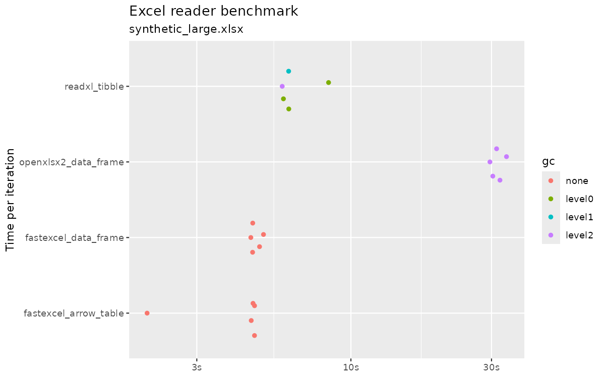
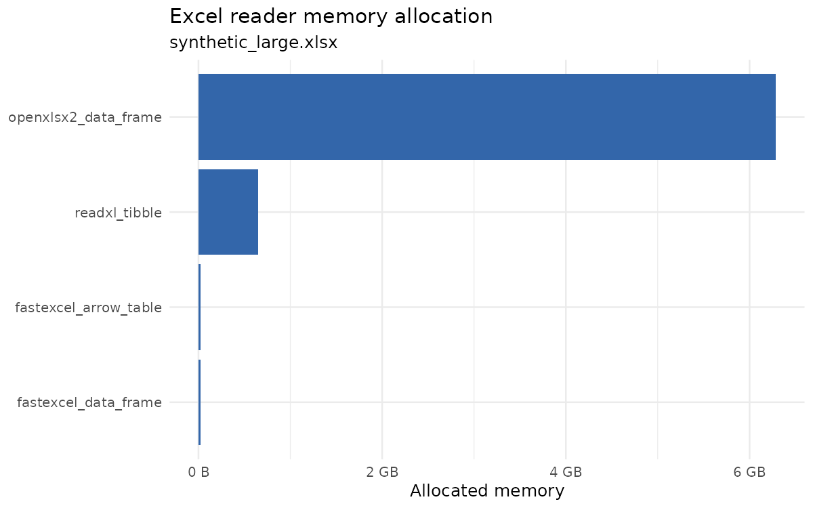

# fastexcel <a href="https://anthonyokc.github.io/fastexcel/"></a>

`fastexcel` is an R package for reading Excel workbooks with a Rust backend. It
uses [ToucanToco's Rust `fastexcel` crate](https://github.com/ToucanToco/fastexcel) and returns results in R.

## Features

- Read Excel worksheets into an `arrow::Table` by default.
- Convert results to a tibble, data frame, or vectors when needed.
- Read from a local file or raw workbook bytes already in memory.
- Read Excel files directly from cloud storage responses that return a raw
  vector, without first writing the workbook to disk.
- Select sheets by 1-based index or sheet name.
- Read column ranges such as `"A:A"` and `"A:D"`, or select columns by name
  or position.
- Control header rows, skipped rows, schema sampling, dtype coercion, and
  whitespace handling.
- Inspect workbook metadata with sheet names, sheet dimensions, table, and
  defined-name helpers.
- Read named Excel tables and inspect table dimensions.
- Inspect sheet and table column metadata, including inferred or specified
  dtypes.
- Catch validation, parsing, dependency, and resource-limit failures with typed
  `fastexcel_error` condition classes.

## Requirements

- R 4.1 or newer
- Rust toolchain with `cargo` and `rustc >= 1.85`
- R package dependency: `arrow`
- Optional R package dependency: `tibble`

## Installation

Install from GitHub with `pak` or `remotes`:

```r
pak::pak("anthonyokc/fastexcel")
```

```r
remotes::install_github("anthonyokc/fastexcel")
```

For local development, install from the repository root:

```sh
R CMD INSTALL .
```

## Usage

```r
library(fastexcel)

file <- system.file("extdata/Pop_Density.xlsx", package = "fastexcel")

table <- read_excel(file)
table
```

Return explicit Arrow objects:

```r
read_excel(file, as = "arrow_table")
read_excel(file, as = "arrow_record_batch")
read_excel(file, range = "A:A", as = "arrow_array")
```

Return a base data frame or tibble:

```r
read_excel(file, as = "data.frame")
read_excel(file, as = "tibble")
```

Read a single column as a vector:

```r
read_excel(file, range = "A:A", as = "vector")
```

`as = "arrow_array"` returns an Arrow array. `as = "vector"` returns a base R
vector for one-column output or a named list of base R vectors for multi-column
output.

Select a sheet by index or name:

```r
read_excel(file, sheet = 1)
read_excel(file, sheet = "Sheet1")
```

Select columns by name or 1-based position:

```r
read_excel(file, columns = c("city", "Year"))
read_excel(file, columns = c(1, 2))
```

Inspect workbook metadata:

```r
excel_sheets(file)
excel_sheet_info(file)
excel_sheet_columns(file)
excel_tables(file)
excel_table_info(file)
excel_table_columns(file, "Table1")
excel_defined_names(file)
```

Read a named Excel table:

```r
read_excel_table(file, "Table1", as = "data.frame")
```

## Benchmark

On the latest 5-iteration benchmark of the repository's large workbook
(`inst/extdata/synthetic_large.xlsx`, about 123 MB compressed), `fastexcel`
was the fastest or effectively tied for fastest reader in this repo while using
far less memory than `readxl` and `openxlsx2`.

| Reader | Median time | R memory allocated |
|---|---:|---:|
| `fastexcel::read_excel(..., as = "data.frame")` | `4.64s` | `19.97MB` |
| `fastexcel::read_excel(..., as = "arrow_table")` | `4.66s` | `21.63MB` |
| `readxl::read_excel()` | `6.15s` | `622.55MB` |
| `openxlsx2::read_xlsx()` | `31.21s` | `5.85GB` |

For package users, the practical takeaway is simple: `fastexcel` stays fast on
large workbooks without the memory spikes seen in the other readers benchmarked
here.





## Security and Resource Limits

Excel files can be expensive to parse, especially `.xlsx` files because they are
ZIP archives containing XML. A small compressed workbook can expand into much
larger XML, shared strings, and cell data during parsing. Treat workbooks from
untrusted sources as potentially hostile.

`fastexcel` applies pre-parse checks before handing data to the upstream parser.
These checks reduce risk, but they are resource limits, not a sandbox.

Compressed input size is controlled by:

```r
options(fastexcel.max_workbook_size = 100 * 1024^2)
```

For file paths, this checks the file size before parsing. For raw vectors, the
raw vector has already been allocated by R before `fastexcel` can inspect it, so
this only prevents oversized bytes from being parsed further.

ZIP-based workbooks such as `.xlsx` are also checked using ZIP metadata before
parsing. These options are separate from the compressed-size limit:

```r
options(
  fastexcel.max_zip_entries = 10000,
  fastexcel.max_zip_entry_size = 2 * 1024^3,
  fastexcel.max_zip_total_size = 8 * 1024^3,
  fastexcel.max_zip_compression_ratio = 100
)
```

The limits protect different parts of the workload:

- `fastexcel.max_workbook_size`: compressed file size or raw-vector length.
- `fastexcel.max_zip_entries`: number of files inside the workbook ZIP.
- `fastexcel.max_zip_entry_size`: largest declared uncompressed ZIP entry.
- `fastexcel.max_zip_total_size`: total declared uncompressed ZIP size.
- `fastexcel.max_zip_compression_ratio`: suspicious per-entry expansion ratio.

Current limitations:

- ZIP metadata checks reduce zip-bomb risk but cannot prove a workbook is safe.
- ZIP metadata can be misleading or incomplete in edge cases.
- The checks do not enforce XML parser limits, max cell counts, elapsed-time
  limits, or OS memory limits.
- `n_max` limits returned data rows, but metadata, shared strings, sheet
  structures, and other workbook content may still be parsed first.
- For untrusted uploads or multi-user services, also use upload limits, worker
  process isolation, memory limits, and timeouts.

Read workbook bytes, such as the raw vector returned by cloud storage clients:

```r
bytes <- readBin(file, what = "raw", n = file.info(file)$size)
read_excel(bytes, as = "data.frame")
```

This raw-vector workflow makes it possible to read Excel workbooks directly
from cloud storage downloads in R, without saving a temporary file first.

With `googleCloudStorageR`, pass the downloaded raw object directly:

```r
bytes <- googleCloudStorageR::gcs_get_object("path/to/file.xlsx")
read_excel(bytes, as = "data.frame")
```

## API

### `read_excel()`

```r
read_excel(
  file,
  sheet = 1,
  range = NULL,
  columns = NULL,
  col_names = TRUE,
  header_row = NULL,
  skip_rows = NULL,
  n_max = Inf,
  schema_sample_rows = NULL,
  dtype_coercion = c("coerce", "strict"),
  dtypes = NULL,
  skip_whitespace_tail_rows = FALSE,
  whitespace_as_null = FALSE,
  as = c("arrow_table", "arrow_record_batch", "arrow_array", "tibble", "data.frame", "vector")
)
```

- `file`: path to an Excel workbook, or a raw vector containing workbook bytes.
- `sheet`: 1-based sheet index or sheet name.
- `range`: optional Excel-style range. The current implementation supports
  column selectors such as `"A:A"` and `"A:D"`.
- `columns`: optional character vector of column names or numeric vector of
  1-based column positions. Cannot be combined with `range`.
- `col_names`: `TRUE` to use the first row as names, `FALSE` to generate names,
  or a character vector of explicit names.
- `header_row`: 1-based row containing column names when `col_names = TRUE`,
  or `NULL` to use the upstream first non-empty row behavior.
- `skip_rows`: number of rows to skip after the header row.
- `n_max`: maximum number of data rows to read.
- `schema_sample_rows`: number of rows to sample for schema inference.
- `dtype_coercion`: `"coerce"` or `"strict"` handling for mismatched values.
- `dtypes`: optional dtype override, either a single dtype string or a named
  character vector mapping columns to dtype strings.
- `skip_whitespace_tail_rows`: whether trailing whitespace/null rows are ignored.
- `whitespace_as_null`: whether whitespace-only strings are treated as missing.
- `as`: output type. `"arrow_table"` is the default public tabular output,
  `"arrow_record_batch"` is a lower-level Arrow option, and `"arrow_array"` is
  valid only for one-column selections.

### Metadata Helpers

- `excel_sheets(file)`: returns sheet names.
- `excel_sheet_info(file, sheet = NULL)`: returns a tibble of sheet names,
  dimensions, and visibility metadata, optionally filtered by sheet index or
  name.
- `excel_sheet_columns(file, sheet = 1, ...)`: returns sheet column metadata for
  selected columns, or all available columns with `available = TRUE`.
- `excel_tables(file, sheet = NULL)`: returns table names, optionally filtered by
  sheet name.
- `excel_table_info(file, table = NULL)`: returns table names, parent sheet
  names, and dimensions, optionally filtered by table name.
- `excel_table_columns(file, table, ...)`: returns table column metadata for
  selected columns, or all available columns with `available = TRUE`.
- `excel_defined_names(file)`: returns defined-name metadata as a tibble.

### Error Classes

All package errors inherit from `fastexcel_error`. More specific subclasses are
used where possible: `fastexcel_validation_error`,
`fastexcel_resource_limit_error`, `fastexcel_parse_error`, and
`fastexcel_dependency_error`.

## Roadmap

Legend: ✅ implemented, ◐ partially implemented, ❌ not implemented.

| Original `fastexcel` feature | Current R package | Status |
|---|---:|---:|
| Open Excel workbook from file path | `read_excel(file)` | ✅ |
| Open workbook from bytes | `read_excel(raw_bytes)` | ✅ |
| List sheet names | `excel_sheets(file)` or `excel_sheets(raw_bytes)` | ✅ |
| Load sheet by index | `read_excel(file, sheet = 1)` using 1-based R index | ✅ |
| Load sheet by name | `read_excel(file, sheet = "Sheet1")` | ✅ |
| Return Arrow `Table` | `read_excel(..., as = "arrow_table")` default | ✅ |
| Return Arrow `RecordBatch` | `read_excel(..., as = "arrow_record_batch")` | ✅ |
| Return Arrow `Array` | `read_excel(..., range = "A:A", as = "arrow_array")` | ✅ |
| Arrow C Data Interface handoff | Rust exports Arrow arrays/record batches; R imports them with Arrow's C Data Interface | ✅ |
| End-to-end zero-copy Arrow buffers | Avoids the R-vector boundary for `read_excel()` outputs; Rust array construction may still copy from upstream series data | ◐ |
| Convert to data frame-like output | `as = "data.frame"`, `as = "tibble"` | ✅ |
| Return vectors/list of vectors | `as = "vector"` | ✅ |
| Use first row as column names | `col_names = TRUE` | ✅ |
| No header row / generated names | `col_names = FALSE` | ✅ |
| Override column names | `col_names = c(...)` | ✅ |
| Limit rows | `n_max` maps to upstream `n_rows` | ✅ |
| Select columns by Excel range/string | `range`, documented for `A:A`, `A:D`; Rust bridge also delegates to upstream parser | ◐ |
| List table names | `excel_tables(file)` or `excel_tables(raw_bytes)` | ✅ |
| Filter table names by sheet name | `excel_tables(file, sheet = "Sheet1")` | ✅ |
| Inspect table metadata | `excel_table_info(file)` or `excel_table_info(raw_bytes)` | ✅ |
| List defined names / named ranges | `excel_defined_names(file)` or `excel_defined_names(raw_bytes)` | ✅ |
| Primitive dtype conversion | bool/string/int/float/date/datetime/duration handled in Rust bridge | ✅ |
| Supported workbook formats from upstream `fastexcel`/`calamine` | Uses upstream `fastexcel::read_excel(path)` | ✅ |
| Arbitrary `header_row` index | `header_row`, using 1-based R row numbers | ✅ |
| `skip_rows` | `skip_rows` for fixed row counts | ◐ |
| `schema_sample_rows` | `schema_sample_rows` | ✅ |
| `dtype_coercion = "coerce"/"strict"` | `dtype_coercion` | ✅ |
| Explicit `dtypes` / dtype map | `dtypes = "string"` or named character vector | ✅ |
| Select columns by list of names/indices | `columns = c("name")` or `columns = c(1, 2)` | ✅ |
| Select columns by callback | Not applicable/exposed | ❌ |
| `skip_whitespace_tail_rows` | `skip_whitespace_tail_rows` | ✅ |
| `whitespace_as_null` | `whitespace_as_null` | ✅ |
| Lazy `ExcelReader` object | R API opens internally per call | ❌ |
| Lazy `ExcelSheet` object | Not exposed | ❌ |
| `ExcelSheet` metadata: name, width, height, total height, visibility | `excel_sheet_info(file)` or `excel_sheet_info(raw_bytes)` | ✅ |
| Sheet `selected_columns`, `available_columns`, `specified_dtypes` | `excel_sheet_columns(file, ...)` exposes selected/available columns and dtype provenance | ✅ |
| `to_arrow_with_errors` / cell parse error reporting | Not exposed | ❌ |
| `load_table` | `read_excel_table(file, "Table1")` | ✅ |
| `ExcelTable` object/metadata | `excel_table_info(file)` exposes table metadata; lazy table objects are not exposed | ◐ |
| Table-to-Arrow/dataframe conversion | `read_excel_table(..., as = "arrow_table")`, `"data.frame"`, `"tibble"`, or `"vector"` | ✅ |
| `ColumnInfo` metadata | `excel_sheet_columns()` and `excel_table_columns()` expose name, index, dtype, and provenance | ✅ |
| Typed exception classes | R errors inherit from `fastexcel_error` with validation, resource-limit, parse, and dependency subclasses | ✅ |

## Development

Run tests with:

```sh
Rscript -e 'testthat::test_local()'
```

Run a package check with:

```sh
R CMD check .
```

The Rust crate for the package lives in `src/rust` and is built as part of the R
package installation process.

## License

This R package is licensed under MIT. See `LICENSE` for details.

This package links to several upstream Rust crates. In particular, it uses
ToucanToco's Rust `fastexcel` crate, which is licensed under MIT and provides
nearly all of this package's Excel parsing functionality. `fastexcel` delegates
workbook parsing to `calamine`, also licensed under MIT.

The Rust bridge also links to Apache Arrow Rust crates (`arrow-array` and
`arrow-schema`, Apache-2.0), `chrono` (MIT OR Apache-2.0), `extendr-api` (MIT),
and `zip` (MIT). This package gratefully acknowledges and thanks these upstream
authors for their work. See [`inst/NOTICE`](inst/NOTICE) for upstream copyright,
repository, and license details.
